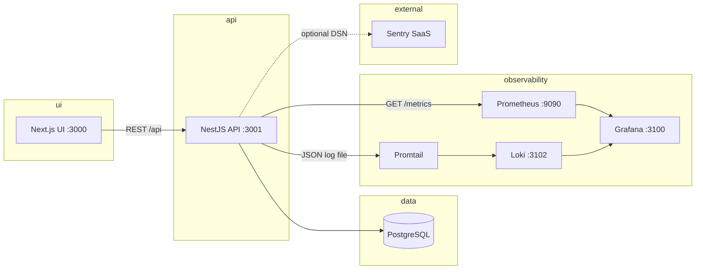

# Signal Lab

**Signal Lab** is a small full-stack **observability playground**: a Next.js UI runs synthetic **scenario** flows against a NestJS API; each run is stored in PostgreSQL (Prisma) and produces **metrics**, **structured logs** (Loki via Promtail), and optional **Sentry** events. The repo also ships a **Cursor AI layer** (rules, skills, commands, hook playbooks, orchestrator) under `.cursor/`.

For the original assignment brief, see `ASSIGNMENT.md`. Before submitting, fill `SUBMISSION_CHECKLIST.md`.

---

## Quick start

From the repository root:

```bash
cp .env.example .env
docker compose up -d
```

Wait until containers are healthy, then:

```bash
curl -s http://localhost:3001/api/health
```

Expected JSON shape: `{"status":"ok","timestamp":"<ISO-8601>"}`.

| What | URL |
|------|-----|
| UI | http://localhost:3000 |
| API (Swagger) | http://localhost:3001/api/docs |

Stop:

```bash
docker compose down
```

---

## Services

Host ports match `docker-compose.yml` (defaults; override with `.env` where noted).

| Service | URL / host | Credentials | Purpose |
|---------|------------|---------------|---------|
| **frontend** | http://localhost:3000 | — | Next.js App Router UI |
| **backend** | http://localhost:3001 | — | NestJS API + `GET /metrics` |
| **postgres** | `localhost:${POSTGRES_PORT:-5432}` | user / password / DB from `.env.example` (`signal_lab` / `signal_lab_password` / `signal_lab`) | PostgreSQL 16 |
| **prometheus** | http://localhost:9090 | — | Scrapes backend metrics (`signal-lab-backend` job) |
| **grafana** | http://localhost:3100 | `GRAFANA_ADMIN_USER` / `GRAFANA_ADMIN_PASSWORD` (default **admin** / **admin**) | Dashboards + Explore (Prometheus + Loki) |
| **loki** | http://localhost:3102 | — | Log store (HTTP API; Explore in Grafana is the usual check) |
| **promtail** | *(no host port published)* | — | Tails backend log file volume, pushes to Loki |

**Sentry** is not a Compose service: the backend sends events to your Sentry project when `SENTRY_DSN` is a real DSN (the value in `.env.example` is a placeholder).

---

## Architecture



---

## Scenario runner

API: `POST /api/scenarios/run` with JSON `{ "type": "<type>", "name": "<optional>" }` (see `CreateScenarioRunDto` in `apps/backend/src/scenarios/dto/create-scenario-run.dto.ts`). List recent runs: `GET /api/scenarios`.

| Scenario | HTTP | What happens | Expected signals |
|----------|------|--------------|------------------|
| `success` | **200** | Run saved as completed | Info log; `scenario_runs_total` with `status` **completed**; duration histogram |
| `validation_error` | **400** | Run saved, then `BadRequestException` | Warn log; metric with `status` **error**; Sentry **breadcrumb** (not an error event by default) |
| `system_error` | **500** | Run saved, synthetic error thrown | Error log; metric **error**; **Sentry exception** (if DSN enabled and not placeholder) |
| `slow_request` | **200** | Random delay **2–5 s**, then saved as slow | Warn log; metrics for completed path after delay |
| `database_timeout` | **504** | PostgreSQL `statement_timeout` + `pg_sleep` forces cancel; run saved as **timeout** | Error log; metric `status` **timeout**; **Sentry exception** (if DSN enabled) |
| `external_api_timeout` | **504** | Outbound `fetch` to **`SCENARIO_EXTERNAL_API_URL`** (default `https://httpbin.org/delay/3`) with **~120 ms** client abort; run saved as **external_timeout** | Error log; metric `status` **external_timeout**; **Sentry** (if DSN enabled); requires outbound network from backend unless URL overridden |
| `cache_miss_spike` | **200** | In-process synthetic cache: many **cold keys** in one request; run saved as **cache_miss_spike** | Warn log; metric `status` **cache_miss_spike**; Sentry **breadcrumb** (not an error event) |
| `teapot` | **418** | Run saved with teapot metadata; body includes `signal: 42` | Info log; metric label `status` **teapot** (bonus / easter-egg path per PRD 002 F4) |

---

## Verification walkthrough (~5 minutes)

1. **Stack** — `docker compose up -d` (use `POSTGRES_PORT=5433` if host `5432` is already in use).
2. **UI** — Open http://localhost:3000 .
3. **Success** — Run scenario `success`; confirm a **completed** entry in run history.
4. **System error** — Run `system_error`; confirm error feedback in UI and an **error** (or equivalent) row in history.
5. **Metrics** — `curl -s http://localhost:3001/metrics | grep scenario_runs_total` (counter lines appear after runs).
6. **Grafana** — Log in at http://localhost:3100 (`admin` / `admin` by default). Open **Signal Lab Observability**:  
   http://localhost:3100/d/signal-lab-observability/signal-lab-observability
7. **Loki** — Grafana → **Explore** → Loki → query `{app="signal-lab"}` (run at least one scenario first).
8. **Sentry** — Only if you replaced `SENTRY_DSN` with a real project DSN: repeat `system_error`, `database_timeout`, or `external_api_timeout` and confirm the event in Sentry.
9. **Teapot** (optional) — `curl -i -X POST http://localhost:3001/api/scenarios/run -H "Content-Type: application/json" -d '{"type":"teapot"}'` → expect **418** and JSON containing `"signal":42`.
10. **Database timeout** (optional) — `curl -i -X POST http://localhost:3001/api/scenarios/run -H "Content-Type: application/json" -d '{"type":"database_timeout"}'` → expect **504** and a history row with status **timeout**.
11. **External API timeout** (optional, needs outbound HTTP from backend) — same curl with `'{"type":"external_api_timeout"}'` → expect **504** and history status **external_timeout** (override URL via `SCENARIO_EXTERNAL_API_URL` in `.env` / Compose).
12. **Cache miss spike** (optional) — `'{"type":"cache_miss_spike"}'` → **200** and history status **cache_miss_spike**; check Loki for the warn line and `scenario_runs_total` label.

---

## Observability

| Signal | How to reproduce | Where to check | Expected |
|--------|-------------------|----------------|----------|
| **Metrics** | Run any scenario | `curl -s http://localhost:3001/metrics` and/or Grafana dashboard | `scenario_runs_total`, `scenario_run_duration_seconds`, `http_requests_total` |
| **Prometheus scrape** | Stack up | http://localhost:9090/targets | Job `signal-lab-backend` **UP** |
| **Logs** | Run scenarios | Grafana Explore → Loki `{app="signal-lab"}` | JSON lines with `scenarioType`, `scenarioId`, etc. |
| **Sentry** | Real DSN + `system_error` | Sentry project | Captured exception |
| **Dashboard** | After traffic | Grafana dashboard URL above | Panels reflect runs / latency / errors |

---

## Cursor AI layer

Rules live in `.cursor/rules/*.mdc` (Cursor loads them as project rules). Skills, commands, and hook **playbooks** live under `.cursor/`; hook files are **manual checklists** — this repo does **not** ship `hooks.json` for automatic Cursor hooks.

### Rules

| File | Scope |
|------|--------|
| `stack-constraints.mdc` | Allowed / forbidden libraries (frontend + backend) |
| `observability-conventions.mdc` | Metric names, log shape, Sentry usage |
| `prisma-patterns.mdc` | Prisma usage; no ad-hoc raw SQL |
| `frontend-patterns.mdc` | TanStack Query, RHF + Zod, shadcn-style UI |
| `error-handling.mdc` | NestJS HTTP errors, no silent swallowing |

### Custom skills (`SKILL.md` in each folder)

| Folder | Use when |
|--------|----------|
| `observability` | Wiring `MetricsService`, `AppLoggerService`, `SentryService` |
| `nestjs-endpoint` | New Nest feature module aligned with `scenarios` |
| `prisma-schema` | Editing `prisma/schema.prisma` and migration flow |
| `signal-lab-orchestrator` | PRD-style multi-phase runs (see **Orchestrator** below) |

### Commands (`.cursor/commands/`)

| Command | Role |
|---------|------|
| `/health-check` | Compose health + smoke checks |
| `/check-obs` | Observability checklist for a service file or route |
| `/add-endpoint` | Scaffold Nest endpoint using repo observability pattern |
| `/run-prd` | Drive orchestrator skill + `context.json` contract |

### Hook playbooks (`.cursor/hooks/`)

| File | Prevents |
|------|----------|
| `after-new-endpoint.md` | Missing metrics / logs / Sentry / DTO validation after new routes |
| `after-prisma-schema-change.md` | Schema edits without migrate + generate + compile |
| `before-commit.md` | Secrets in git, staging `.env`, stray `console.log`, blocking TODOs |

### Marketplace skills

**Documented / recommended** third-party skills are listed in `.cursor/marketplace-skills.md`. The repository **does not** include vendored marketplace rule files and **cannot** prove which skills are enabled in your Cursor app — treat them as optional; project `.mdc` rules remain authoritative.

### Orchestrator (PRD 004)

| Item | Detail |
|------|--------|
| **Skill path** | `.cursor/skills/signal-lab-orchestrator/SKILL.md` (subagent templates: `COORDINATION.md`, examples: `EXAMPLE.md`) |
| **Slash command** | `/run-prd` — see `.cursor/commands/run-prd.md` |
| **State file** | `.execution/{executionId}/context.json` (= PRD F1 `.execution/<timestamp>/` with the same folder name) |
| **Phases (7)** | `analysis` → `codebase` → `planning` → `decomposition` → `implementation` → `review` → `report` |
| **Tasks (F4)** | Each task **5–10 min**, **`description`** 1–3 sentences, **`suggestedSkill`** tied to repo skills; **no** single mega-task spanning backend + frontend + docs |
| **Models** | `tasks[].model`: **`fast`** for mechanical work; **`default`** for architecture, multi-system, tricky observability/error semantics (PRD F3 — intent: small models do most tasks, not a fixed ratio) |
| **Review / retry** | Read-only reviewer; up to **3** retries per task; **hook playbooks** (`.cursor/hooks/*.md`) applied **manually** in review; **pass / fail / skipped** in `report.md` when relevant; failed tasks stay visible and do not block unrelated tasks (PRD F6–F7) |
| **Resume** | Same `executionId` folder: read `context.json` first; if `status` is `in_progress`, continue from `currentPhase` / next pending task; **do not** redo completed phases; **failed** tasks remain in JSON and final report |
| **Git** | Orchestrator docs: no force push / hard reset / branch delete; branch/commit only if **you** ask for git workflow |
| **Hooks** | **Playbooks** under `.cursor/hooks/*.md` (manual); not auto-run unless you add real Cursor hook config |

---

## Project structure

```text
signal-lab/
├── apps/
│   ├── frontend/          # Next.js App Router
│   └── backend/           # NestJS API
├── prisma/
│   ├── schema.prisma
│   └── migrations/
├── infra/                 # prometheus, grafana, loki, promtail
├── prds/                  # Product requirement docs
├── .cursor/               # Rules, skills, commands, hook playbooks
├── docker-compose.yml
├── .env.example
├── ASSIGNMENT.md
├── SUBMISSION_CHECKLIST.md
└── README.md
```

---

## Troubleshooting

| Symptom | What to try |
|---------|-------------|
| Container errors | `docker compose logs <service>` — e.g. `backend`, `frontend`, `postgres`, `prometheus`, `grafana`, `loki`, `promtail` |
| Port **5432** busy | `POSTGRES_PORT=5433 docker compose up -d` (keep `DATABASE_URL` pointing at `postgres:5432` inside Compose unless you know you changed it) |
| Stale DB / volumes | `docker compose down -v` then `docker compose up -d` (backend entrypoint runs `prisma migrate deploy` on startup) |
| Types / client out of date (local dev) | From repo root: `npm run prisma:generate`; from `apps/backend`: `npm run prisma:generate` (see `apps/backend/package.json`) |

---

## Stop / reset

```bash
docker compose down
```

Remove containers **and** named volumes (full data reset):

```bash
docker compose down -v
```

---

## Local development (without Docker)

Requires Node **20+** and a running PostgreSQL instance whose URL you put in `DATABASE_URL`.

```bash
cd apps/backend && npm install && npm run start:dev
cd apps/frontend && npm install && npm run dev
```

Prisma schema path: `prisma/schema.prisma`. Root scripts: `npm run prisma:generate`, `npm run prisma:migrate:deploy`.

---

## API quick reference

```bash
# Health
curl -s http://localhost:3001/api/health

# Run scenario
curl -s -X POST http://localhost:3001/api/scenarios/run \
  -H "Content-Type: application/json" \
  -d '{"type":"success","name":"smoke"}'

# Recent runs
curl -s http://localhost:3001/api/scenarios
```

---

## Rubric

Grading criteria for the take-home are in `RUBRIC.md` (application, observability, Cursor AI layer, orchestrator, documentation).
